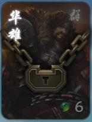
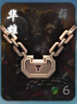
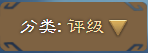
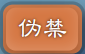
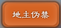
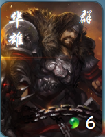
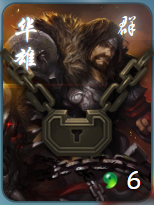
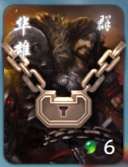
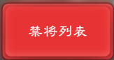

# 扩展介绍
这是一个轻量级、多功能的禁将扩展，提供“仅点将可选禁将”、“仅玩家可选伪禁”以及“高级伪禁”等多种禁将方式，旨在帮助玩家更高效地进行武将筛选与禁用操作，提升对战体验。

## 一、禁将方式说明

### 1. 仅点将可选禁将

玩家和AI角色都不能在对局内选到被此方式禁用的武将，点将除外。禁将样式是黑色锁链：

### 2. 仅玩家可选伪禁

仅针对AI角色的禁将，因为是通过替换武将牌的方式实现禁将，所以叫“伪禁”。来源于扩展《AI优化》:

> 游戏开始或隐匿武将展示武将牌时，若场上有AI选择了“仅玩家可选伪禁列表”里包含的ID对应武将，则勒令其从未加入游戏且不包含伪禁列表武将的将池里再次进行选将。

禁将样式是白色锁链：

**注意：如果有多个扩展同时设置了伪禁功能，本扩展的伪禁功能可能无法生效，或者令其他扩展的伪禁功能无法生效。**

### 3. 高级伪禁

这是一种细粒度的伪禁方式，限定AI角色在特定模式和特定身份的禁将，禁将样式一样是白色锁链：

技巧：由于仅玩家可选伪禁是作用于全模式全身份的，因此，如果一个武将被加入了“仅玩家可选伪禁列表”，则高级伪禁无需重复再禁用。

## 二、将池与方案说明

创建将池或方案时，将当前禁将方式的禁将数据保存到本体文件（文件路径：`extension/AI禁将/plans/*.json`），此文件不会记录当前的禁将方式。读取时，将对应文件保存的禁将数据动态更改当前禁将方式的禁将列表。

### 将池与方案的区别

**方案：** 方案文件保存的当前禁将方式已被禁用的武将列表，读取时直接更改当前禁将方式的禁将列表。

**将池：** 将池文件保存的全扩所有是未被禁用的武将列表，读取时根据当前的全扩武将把将池外的所有武将先转换成禁将列表，再进行更改。（`将池 = 全扩武将 - 当前禁将`）

## 三、按钮状态说明

### 1. 分类按钮

当前的分类方式

### 2. 伪禁按钮

普通状态，当前禁将方式为仅点将可选禁将

高亮状态，当前禁将方式为仅玩家可选伪禁

高亮状态并且按钮文字有前缀，当前禁将方式为对应的高级伪禁

### 3. 武将按钮

普通状态，无事发生

锁链状态，已被选择，但未真正加入禁将列表

锁链 + 小黑屋状态，已被加入对应的禁将列表

### 4. 禁将列表按钮

高亮状态，展示当前武将包和当前武将包分类处于锁链状态或小黑屋状态的武将

## 四、导出/导入禁将设置说明

导出时，把当前的禁将设置（包含所有禁将方式的禁将列表）保存到本地文件（文件路径：`extension/AI禁将/settings/*.json`）。

导入时，把对应文件的禁将设置更改为当前的禁将设置。

